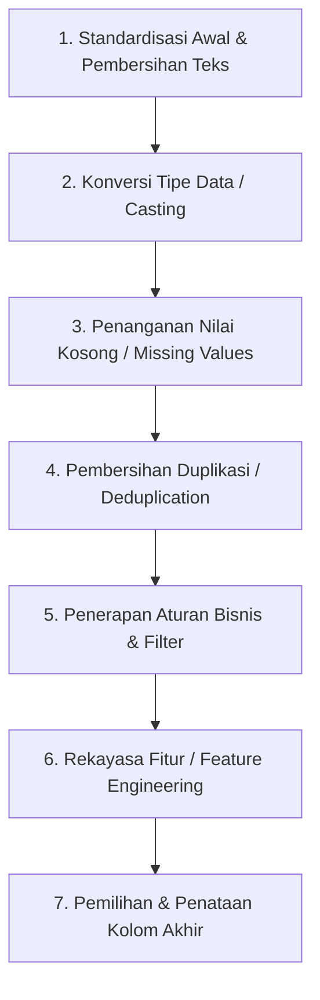

# Best Practice Urutan Transformasi Data (Data Transformation Pipeline)

Dokumen ini menjelaskan urutan (urutan prioritas/sekuensial) yang direkomendasikan saat melakukan fase **Transform** pada pipeline data ETL menggunakan Python & Pandas. 

Meskipun secara teknis tidak ada aturan kaku dari kompiler Python, mengikuti urutan logis sangat penting untuk mencegah bug kehilangan data, duplikasi tersembunyi, atau inkonsistensi skema.

---

## Urutan Transformasi yang Direkomendasikan (Best Practice Workflow)

Untuk hasil maksimal, jalankan proses transformasi data dengan urutan sebagai berikut:



---

## Penjelasan Detil Setiap Fase

### 1. Standardisasi Awal & Pembersihan Teks (Standardization & Trimming)
* **Aktivitas:** Menghapus spasi berlebih di awal/akhir string (`strip`), mengubah teks menjadi huruf kecil atau besar (standardisasi casing), dan mengubah nama kolom menjadi seragam (misal: *snake_case*).
* **Mengapa Pertama?:** Jika ada data teks seperti `" 12345 "` (ada spasi) dan `"12345"`, mereka akan dianggap berbeda oleh Python. Pembersihan awal ini memastikan proses selanjutnya (seperti pencarian duplikasi atau konversi tipe) berjalan akurat.

### 2. Konversi Tipe Data (Type Casting)
* **Aktivitas:** Mengubah teks tanggal menjadi objek datetime (`pd.to_datetime`), angka bertipe string menjadi numerik (`pd.to_numeric`).
* **Mengapa Kedua?:** 
  * Konversi tipe data sering menghasilkan nilai kosong baru jika parsing gagal (nilai berubah menjadi `NaN` atau `NaT` akibat argumen `errors='coerce'`). 
  * Nilai kosong baru ini harus dideteksi dan ditangani pada langkah berikutnya.

### 3. Penanganan Nilai Kosong (Handling Missing Values)
* **Aktivitas:** Membuang baris yang memiliki nilai penting yang kosong (seperti baris tanpa `CustomerID` atau `InvoiceNo`), atau mengisinya dengan nilai default (*imputation* seperti `"Unknown"` atau `0`).
* **Mengapa Ketiga?:** Kita harus menangani nilai kosong setelah konversi tipe data selesai, agar semua nilai `NaN`/`NaT` hasil dari kegagalan konversi tipe data di langkah 2 ikut dibersihkan atau ditangani.

### 4. Pembersihan Duplikasi (Deduplication)
* **Aktivitas:** Membuang baris data yang duplikat menggunakan `df.drop_duplicates()`.
* **Mengapa Keempat?:** 
  * Dua baris data yang sebenarnya duplikat sering terlihat unik karena perbedaan kecil (misal spasi teks `" 123 "` vs `"123"`, atau format tanggal).
  * Dengan melakukan *Text Cleaning* dan *Type Casting* terlebih dahulu, data tersebut akan menjadi benar-benar identik sehingga dapat terdeteksi sebagai duplikat dan dibuang dengan sempurna.

### 5. Penerapan Aturan Bisnis & Filter Data (Business Logic Filtering)
* **Aktivitas:** Memfilter baris data berdasarkan aturan bisnis, misalnya membuang transaksi dengan harga negatif (`UnitPrice < 0`) atau memisahkan data transaksi pembatalan (`InvoiceNo` berawalan `'C'`).
* **Mengapa Kelima?:** Melakukan filter pada data yang sudah bersih dari nilai kosong, duplikat, dan salah tipe data akan jauh lebih aman dan efisien secara komputasi.

### 6. Rekayasa Fitur (Feature Engineering)
* **Aktivitas:** Membuat kolom kalkulasi baru seperti `TotalAmount` (`Quantity` * `UnitPrice`) atau memecah tanggal menjadi kolom `Year`, `Month`, `Day`.
* **Mengapa Keenam?:** Pembuatan fitur baru membutuhkan kolom asal yang sudah bersih dan bertipe data benar. Misalnya, menghitung `TotalAmount` akan error jika kolom `UnitPrice` masih bertipe string.

### 7. Pemilihan & Penataan Kolom Akhir (Column Selection & Ordering)
* **Aktivitas:** Memilih hanya kolom-kolom yang diperlukan untuk database target dan mengurutkan posisinya agar sesuai dengan skema tabel database.
* **Mengapa Terakhir?:** Langkah ini merapikan hasil akhir sebelum masuk ke fase **Load**.

---

## Contoh Implementasi Pipeline yang Rapi (Pandas Pipe Pattern)

Untuk menjaga modularitas, buatlah fungsi kecil untuk setiap langkah di atas, kemudian rangkai menggunakan metode `.pipe()` milik Pandas:

```python
# Contoh struktur visual pipeline di main orchestrator
df_transformed = (
    df_raw
    .pipe(standardize_text)
    .pipe(fix_data_types)
    .pipe(handle_missing_values)
    .pipe(remove_duplicates)
    .pipe(apply_business_rules)
    .pipe(add_features)
    .pipe(select_final_columns)
)
```
Dengan struktur seperti ini, kode Anda akan sangat mudah dibaca, diuji per fungsi, dan dirawat oleh anggota tim data engineering lainnya.
