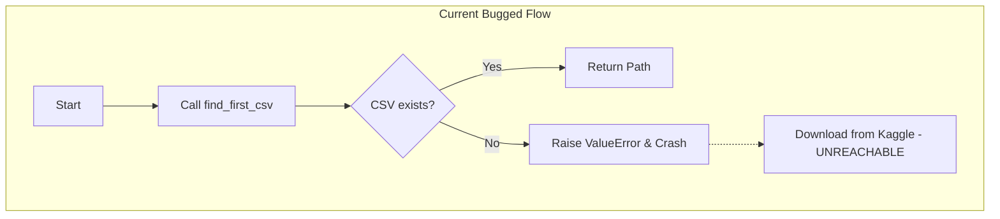
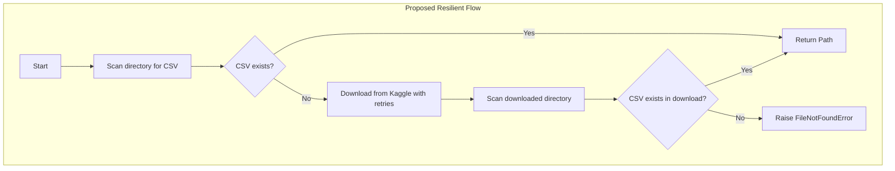

# Code Review: `extract.py`

This document provides a comprehensive, senior-level code review of [extract.py](file:///C:/Users/korba/OneDrive/Documents/PROJECTS/ETL_Pipeline_Python/src/extract.py) based on production-grade data engineering best practices.

## Executive Summary

The current implementation of `extract.py` provides a basic workflow to fetch and load a Kaggle dataset into a Pandas DataFrame. While the logic is functional for small datasets in local interactive environments, it contains a **critical control-flow bug** and several patterns that violate production data engineering standards (scalability, resilience, logging isolation, and config decoupling).

---

## Critical Bug: Downstream Control-Flow Crash

> [!IMPORTANT]
> **Defect**: The pipeline crashes before downloading the dataset if the local directory is empty.

### The Bug Mechanism
In [extract.py:L137-146](file:///C:/Users/korba/OneDrive/Documents/PROJECTS/ETL_Pipeline_Python/src/extract.py#L137-146), the code checks for local CSV files:
```python
# Check have a files .csv on folder data?.
csv_path = find_first_csv(data_dir)

# If There Isn't Any, Now Download From Kaggle
if not csv_path:
    ...
```
However, in `find_first_csv` (lines 52-54):
```python
if not csv_files:
    logger.error("⚠️ No CSV files found in dataset path: %s", dataset_path)
    raise ValueError("No CSV files found in dataset path")
```
Because `find_first_csv` raises a `ValueError` instead of returning `None` or an empty list, the execution halts immediately. The conditional block `if not csv_path:` is unreachable when the folder is empty.

### Flow Comparison





---

## Production Design Concerns & Recommendations

### 1. Memory Scalability (Out-of-Memory Risks)
* **Problem**: `pd.read_csv(file_path)` loads the entire CSV into memory at once. If the dataset grows to gigabytes, this will cause Out-Of-Memory (OOM) failures in production containers.
* **Recommendation**:
  - **Batching/Chunking**: Read the data in chunks using `chunksize` and process incrementally if downstream tasks support streaming.
  - **Schema Enforcement**: Pass `dtype` to avoid memory-heavy object conversions and speed up parsing.
  - **Modern alternatives**: For larger files, consider using `pyarrow`, `polars`, or `duckdb` which are faster and use memory-efficient column mapping.

### 2. Lack of Resilience (API Retries)
* **Problem**: Network calls to external APIs like Kaggle are prone to transient network failures, timeout issues, or API rate limits. Currently, any failure in `kagglehub.dataset_download` crashes the pipeline immediately.
* **Recommendation**:
  - Implement retry mechanisms with exponential backoff (e.g. using `tenacity` or standard loops with `time.sleep`).

### 3. Observability and Logging Anti-patterns
* **Problem 1 (Root Logger Mutation)**: `logging.basicConfig(...)` is declared at the module level. When this module is imported into an orchestrator (e.g. `main.py`), it overwrites the logging configuration of the entire process, which is a library design anti-pattern.
* **Problem 2 (Mixed Outputs)**: The code mixes `print()` statements and `logger.info()` arbitrarily. Emojis (e.g., `🔄`, `✔`, `👀`) can cause encoding crashes on Windows console environments if stdout does not support UTF-8 (e.g., `cp1252`).
* **Recommendation**:
  - Remove module-level `logging.basicConfig()`. Let the entrypoint/orchestrator configure logging.
  - Avoid using emojis in logs or fall back to ASCII characters for stdout safety.
  - Standardize on `logging` and remove raw `print` statements.

### 4. Code Quality & Type Safety
* **Problem 1 (Inconsistent Type Hints/Docstrings)**:
  - `download_dataset` lists `output_dir: Path` in signature but `output_dir: Path | None` in docstrings.
  - The docstrings state functions return `None` on error, but the functions actually raise `ValueError`/`FileNotFoundError`.
* **Problem 2 (Generic Catch-All Exceptions)**:
  - In `extract_data_csv`, catching `Exception as e` and raising it is redundant unless adding value. Re-raising a general exception without wrapping can obscure stack traces.
* **Recommendation**:
  - Clean up signatures to use `typing.Optional` / `| None` consistently.
  - Align docstring descriptions with actual raising behavior.
  - Catch only expected exceptions (e.g., `pd.errors.ParserError`, `FileNotFoundError`) and let unexpected ones bubble up naturally.

---

## Detailed Line-by-Line Code Review

| Line Range | Code Snippet | Classification | Findings & Remediation |
| :--- | :--- | :--- | :--- |
| **L9-L13** | `logging.basicConfig(...)` | ⚠️ Anti-pattern | Mutates the global logging configuration. Move this setup to the orchestrator `main.py`'s main block. |
| **L15** | `def download_dataset(dataset:str, output_dir: Path, ...)` | 🔧 Type Hint | The type annotation of `output_dir` should match the docstring (`Optional[Path]`). |
| **L30** | `kagglehub.dataset_download(...)` | 🛑 Resilience | Missing retries for network/API calls. Add retry wrappers. |
| **L51** | `dataset_path.glob("*.csv")` | 🔧 Robustness | Only scans top-level files. Use `rglob("*.csv")` to search subdirectories recursively. |
| **L52-L54** | `if not csv_files: raise ValueError` | ❌ Logic Bug | Raising a `ValueError` here prevents download retry blocks in the caller. Should return `None` or allow an argument `raise_on_empty=False`. |
| **L91** | `df = pd.read_csv(...)` | ⚡ Performance | No memory boundaries. Add chunksize or use polars/arrow for large files. |
| **L111-L113**| `except Exception as e: raise` | 🔧 Code Smell | Catch-all `Exception` block only logs and re-raises. Redundant if no fallback/cleanup is performed. |
| **L140** | `if not csv_path:` | ❌ Logic Bug | Unreachable block due to exception raised in line 137. |

---

## Proposed Refactored Implementation

Below is a proposed refactoring of `src/extract.py` that implements these suggestions, fixes the control-flow bug, adds retry logic, cleans up logging, and increases robustness.

```python
import logging
from pathlib import Path
from typing import Optional
import time
import pandas as pd
import kagglehub

logger = logging.getLogger(__name__)

def download_dataset(
    dataset: str, 
    output_dir: Optional[Path] = None, 
    force_download: bool = False,
    retries: int = 3,
    backoff_factor: float = 2.0
) -> Path:
    """Download Dataset From Kaggle to target directory with exponential backoff.
    
    Args:
        dataset (str): The name of the dataset to download.
        output_dir (Optional[Path]): The path to the directory where the dataset will be downloaded.
        force_download (bool): Whether to force the download of the dataset.
        retries (int): Number of retries on connection error.
        backoff_factor (float): Multiplier for sleep time between retries.
    
    Returns:
        Path: The path to the downloaded dataset.
        
    Raises:
        RuntimeError: If download fails after all retries.
    """
    logger.info("Downloading dataset from Kaggle: %s", dataset)
    
    output_dir_str = str(output_dir) if output_dir else None
    
    for attempt in range(1, retries + 1):
        try:
            path_dataset = kagglehub.dataset_download(
                dataset, 
                output_dir=output_dir_str, 
                force_download=force_download
            )
            logger.info("Download completed successfully.")
            return Path(path_dataset)
        except Exception as e:
            logger.warning("Attempt %d failed to download dataset: %s", attempt, str(e))
            if attempt == retries:
                logger.error("Failed to download dataset after %d attempts", retries)
                raise RuntimeError(f"Kaggle download failed: {str(e)}") from e
            time.sleep(backoff_factor * attempt)

def find_first_csv(dataset_path: Path, raise_on_empty: bool = True) -> Optional[Path]:
    """Find the first CSV file inside the downloaded dataset directory.
    
    Args:
        dataset_path (Path): The path to search.
        raise_on_empty (bool): Whether to raise an error if no CSV file is found.
    
    Returns:
        Optional[Path]: The path to the CSV file, or None if not found.

    Raises:
        ValueError: If no CSV files are found and raise_on_empty is True.
    """
    if not dataset_path.exists():
        if raise_on_empty:
            raise ValueError(f"Path does not exist: {dataset_path}")
        return None

    # Search recursively using rglob
    csv_files = list(dataset_path.rglob("*.csv"))
    if not csv_files:
        if raise_on_empty:
            logger.error("No CSV files found in dataset path: %s", dataset_path)
            raise ValueError("No CSV files found in dataset path")
        return None
        
    logger.info("Found CSV file: %s", csv_files[0])
    return csv_files[0]

def extract_data_csv(file_path: Path) -> pd.DataFrame:
    """Extract data from CSV file.
    
    Args:
        file_path (Path): The path to the CSV file.
    
    Returns:
        pd.DataFrame: DataFrame from the CSV file.

    Raises:
        ValueError: If file path is invalid.
        FileNotFoundError: If file path does not exist.
    """
    if file_path.suffix.lower() != '.csv':
        logger.error("File path does not end with CSV format: %s", file_path)
        raise ValueError("Invalid File Format")

    if not file_path.exists():
        logger.error("File path does not exist: %s", file_path)
        raise FileNotFoundError("File Path Does Not Exist")
        
    logger.info("Reading CSV File: %s", file_path.name)
    try:
        # Load with explicit encoding handling
        return pd.read_csv(file_path, encoding='utf-8')
    except UnicodeDecodeError:
        logger.warning("UTF-8 decoding failed, retrying with ISO-8859-1")
        return pd.read_csv(file_path, encoding='ISO-8859-1')
    except pd.errors.EmptyDataError as e:
        logger.error("CSV file is empty: %s", file_path.name)
        raise ValueError(f"File is empty: {file_path.name}") from e

def extract_get_data(project_root: Path, dataset_name: str = "carrie1/ecommerce-data") -> pd.DataFrame:
    """Extract dataset by checking local directory first, then downloading if missing.
    
    Args:
        project_root (Path): The root path of the project.
        dataset_name (str): The Kaggle dataset identifier.
        
    Returns:
        pd.DataFrame: Loaded DataFrame.
    """
    data_dir = project_root / "data"
    
    # 1. Look for existing CSV file locally (do not raise error if not found)
    csv_path = find_first_csv(data_dir, raise_on_empty=False)

    # 2. Download from Kaggle if no local file exists
    if not csv_path:
        logger.info("Local dataset not found. Downloading from Kaggle...")
        try:
            dataset_path = download_dataset(dataset_name, output_dir=data_dir)
        except Exception as e:
            logger.warning("Failed to download dataset. Retrying with force_download=True. Error: %s", str(e))
            dataset_path = download_dataset(dataset_name, output_dir=data_dir, force_download=True)
            
        csv_path = find_first_csv(dataset_path, raise_on_empty=True)

    if csv_path:
        df = extract_data_csv(csv_path)
        logger.info("Data extraction and load completed successfully.")
        return df
    else:
        raise FileNotFoundError("Target dataset CSV could not be located or downloaded.")

def log_data_summary(dataframe: pd.DataFrame) -> None:
    """Log high-level summary of the dataset without mixing print and logger.

    Args:
        dataframe (pd.DataFrame): The DataFrame to summarize.
    """
    logger.info("--- DATASET SUMMARY ---")
    logger.info("Dimensions - Rows: %d, Columns: %d", dataframe.shape[0], dataframe.shape[1])
    logger.info("Data Types:\n%s", str(dataframe.dtypes))
    
    total_missing = dataframe.isnull().sum()
    missing_cols = {col: val for col, val in total_missing.items() if val > 0}
    if missing_cols:
        logger.info("Missing values count per column: %s", str(missing_cols))
    else:
        logger.info("No missing values detected.")

if __name__ == "__main__":
    # Setup logger for execution as script
    logging.basicConfig(
        level=logging.INFO,
        format="%(asctime)s - %(name)s - %(levelname)s - %(message)s"
    )
    
    # Resolve project root (one level above src)
    root_path = Path(__file__).resolve().parent.parent
    try:
        raw_data = extract_get_data(root_path)
        log_data_summary(raw_data)
    except Exception as err:
        logger.exception("Pipeline extraction phase failed: %s", str(err))
```
